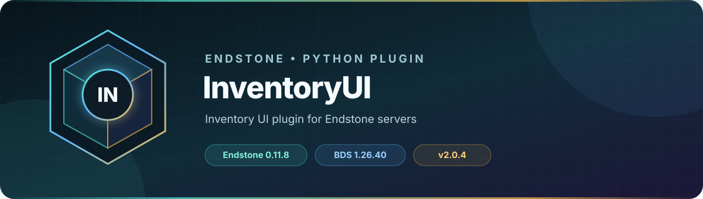

<!-- endstone-professional-header:start -->
<p align="center">
  
</p>

<p align="center">
  <a href="https://github.com/TheNINJALLO/endstone-inventoryui/actions/workflows/wheel-release.yml"></a>
  <a href="https://github.com/TheNINJALLO/endstone-inventoryui/releases/latest"></a>
</p>

<p align="center">
  
  
  
  =3.10" src="https://img.shields.io/badge/Python-%3E=3.10-3776AB?style=flat-square&amp;logo=python&amp;logoColor=white">
</p>

<p align="center">
  <strong>Inventory UI plugin for Endstone servers.</strong>
</p>

<p align="center">
  <a href="#what-it-does">What it does</a> &bull;
  <a href="#how-to-use">How to use</a> &bull;
  <a href="#commands-and-permissions">Commands</a> &bull;
  <a href="#install">Install</a> &bull;
  <a href="https://github.com/TheNINJALLO/endstone-inventoryui/releases">Releases</a>
</p>

## Overview

Inventory UI plugin for Endstone servers. This release is aligned with Endstone 0.11.8 and Minecraft Bedrock Dedicated Server 1.26.40, and is distributed as a Python wheel for direct installation in an Endstone server.

## What it does

- Provides a reusable chest, double-chest, dispenser, and hopper menu API for other Endstone plugins.
- Translates Bedrock inventory packets into safe `MenuTransaction` callbacks.
- Supports click, open, close, queueing, proceed, and discard behavior for custom interfaces.

## How to use

1. Install the wheel as a dependency on every server that runs an InventoryUI-based plugin.
2. From plugin code, create a `Menu`, populate `menu.inventory`, and attach a transaction listener.
3. Call `menu.send_to(player)` to open it and return `proceed()` or `discard()` from each click handler.
4. Use the included `example/` project as the reference implementation.

## Commands and permissions

InventoryUI is a developer API and intentionally registers no player commands. Other plugins import `Menu`, `MenuType`, and `MenuTransaction` and decide how their menus are opened.

## Compatibility

| Component | Supported version |
|---|---|
| Endstone | `0.11.8` |
| Endstone API | `0.11` |
| Bedrock Dedicated Server | `1.26.40` |
| Python | `>=3.10` |
| Plugin release | `v2.0.5` |

## Install

Download [the `v2.0.5` wheel over HTTPS](https://github.com/TheNINJALLO/endstone-inventoryui/releases/download/v2.0.5/endstone_inventoryui-2.0.5-py3-none-any.whl).

Copy the downloaded wheel into the server's `plugins/` directory, remove any older wheel for the same plugin, and restart Endstone.

> [!IMPORTANT]
> Use Endstone `0.11.8` with BDS `1.26.40`. Back up worlds and plugin data before upgrading a production server.

> [!NOTE]
> `v2.0.5` implements the protocol 2169 inventory layout used by BDS `1.26.40`. Earlier InventoryUI wheels can send the retired item-stack network-ID layout and disconnect a player when a virtual inventory opens.

## Configuration and secrets

Runtime databases, logs, local `.env` files, server directories, and root `config.toml` files are excluded from source releases. When an example configuration is provided, copy it locally and keep live tokens, passwords, webhook URLs, and server identifiers out of Git.

## Release automation

Every `v*` tag runs [the wheel release workflow](.github/workflows/wheel-release.yml), builds the package in a clean GitHub runner, stores the wheel as a workflow artifact, and attaches it to the matching GitHub release.
<!-- endstone-professional-header:end -->

---

## Project guide

Virtual inventory plugin for Endstone

## API

### MenuType

Enum for menu container types:

- `MenuType.CHEST` — single chest (27 slots)
- `MenuType.DOUBLE_CHEST` — double chest (54 slots)
- `MenuType.DISPENSER` — dispenser (9 slots)
- `MenuType.HOPPER` — hopper (5 slots)

### Menu

```python
Menu(type: MenuType, name: str = "")
```

**Properties:**

- `inventory` — the `MenuInventory` instance for this menu. Implements an API similar to Endstone's `Inventory`.
- `name` — display name shown at the top of the menu
- `type` — the `MenuType` used to create this menu

**Methods:**

- `set_name(name: str)` — set the display name
- `set_listener(listener)` — set the click callback (see [MenuTransaction](#menutransaction))
- `set_open_listener(listener)` — callback when a player opens the menu: `(player: Player) -> None`
- `set_close_listener(listener)` — callback when a player closes the menu: `(player: Player) -> None`
- `send_to(player: Player)` — display the menu to a player. If the player already has a menu open, this menu is queued and shown after the current one closes.
- `close(player: Player) -> bool` — close this menu for a player
- `close_all()` — close this menu for all players currently viewing it
- `get_viewers() -> list[Player]` — list players who currently have this menu open

### MenuTransaction

**Properties:**

- `player` — the player who clicked
- `slot` — virtual inventory slot index
- `item_clicked` — item in the virtual slot before the action
- `item_clicked_with` — item in the other slot involved (player inventory or cursor)
- `action_type` — the underlying `ItemStackRequestActionType`
- `source` — source slot info from the request
- `destination` — destination slot info from the request

**Methods:**

- `proceed() -> MenuTransactionResult` — allow the transaction to proceed
- `discard() -> MenuTransactionResult` — discard transaction

## Usage

```python
from endstone import Player
from endstone.inventory import ItemStack
from endstone_inventoryui import Menu, MenuType, MenuTransaction, MenuTransactionResult

menu = Menu(MenuType.CHEST)

menu.inventory.set_item(0, ItemStack("minecraft:diamond", 1))
menu.inventory.set_item(1, ItemStack("minecraft:emerald", 1))


def on_click(tr: MenuTransaction) -> MenuTransactionResult:
    if tr.slot == 0:
        tr.player.send_message("You clicked the diamond!")
        return tr.discard()
    elif tr.slot == 1:
        tr.player.send_message("You clicked the emerald!")
        return tr.discard()

    return tr.proceed()


menu.set_listener(on_click)
menu.send_to(player)
```

See the [example plugin](./example) for a full project.
